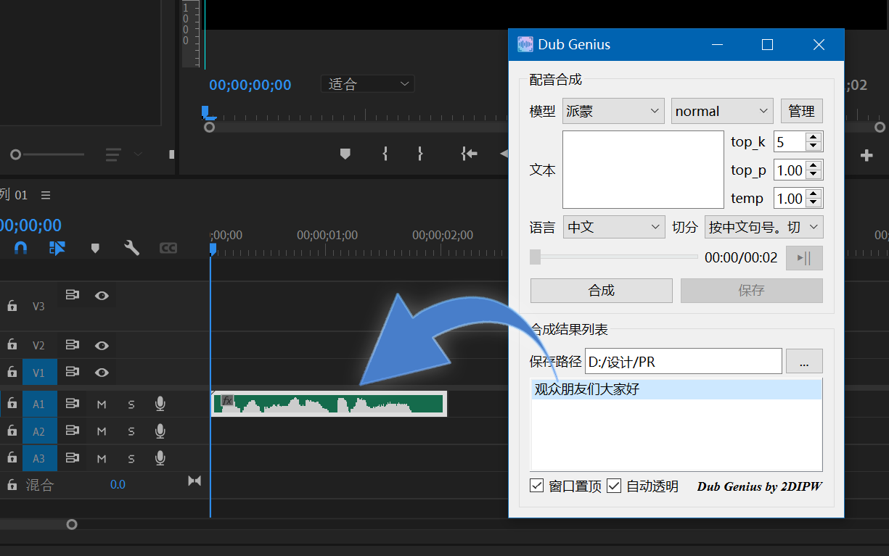

<div class="title" align=center>
    <h1>Dub Genius</h1>
	<div>基于 GPT-SoVITS 的视频剪辑快捷配音工具</div>
    <br/>
    <p>
        
    	
        
        
        
</div>

## 🚩 简介
本项目是一个拥有 GUI 悬浮窗界面的 GPT-SoVITS 推理程序，可以通过模拟操作系统的文件拖拽信号，将合成的语音直接拖拽至视频剪辑软件（如 Adobe Premiere）的时间轴，更加方便地实现视频的配音。

推理核心源码基于 [RVC-Boss/GPT-SoVITS](https://github.com/RVC-Boss/GPT-SoVITS) 修改，GUI 界面基于 PySide6 实现，exe可执行文件由 [PyStand](https://github.com/skywind3000/PyStand) 编译。

## 💻 截图


## 📥 部署
可以直接下载带有 exe 可执行文件的整合包，也可以自行部署依赖环境并从命令行运行。
### 整合包
整合包自带全部依赖和预训练模型，以及一个 Python 3.9.13 的嵌入式版本，可通过 exe 可执行文件独立运行。

||PyTorch版本|大小|下载地址|
|-|-|-|-|
|CPU推理版本|2.2.1|989 MB|[OneDrive](https://1drv.ms/u/s!ApF_M_PJgMjabK4tbMUTw5nFt-g?e=C3O0JN) \| [百度网盘](https://pan.baidu.com/s/1sKlushysdxq1ce-IBHcJaw?pwd=nqwm)|
|GPU推理版本|2.2.1+cu118|2.18 GB|[OneDrive](https://1drv.ms/u/s!ApF_M_PJgMjabWCA4_s3fwxwi7M?e=nObvOo) \| [百度网盘](https://pan.baidu.com/s/1pR1gNF1TmIl_5kASQzEnJQ?pwd=nbqa)|
### 自行部署
#### 克隆
```shell
git clone https://github.com/2DIPW/dub_genius.git
cd dub_genius
```
#### 安装依赖
如果有现成的为 [RVC-Boss/GPT-SoVITS](https://github.com/RVC-Boss/GPT-SoVITS) 配置的环境，为了节省空间，可以在其基础上安装 PySide6。
```shell
pip install pyside6
```
否则，请安装全部依赖
```shell
pip install -r requirements.txt
```
#### 配置 GPU 加速（可选）
安装 CUDA 版本的 PyTorch
```shell
pip install torch --index-url https://download.pytorch.org/whl/cu118
```
#### 配置预训练模型
本项目需要 [RVC-Boss/GPT-SoVITS](https://github.com/RVC-Boss/GPT-SoVITS) 中的`GPT_SoVITS/pretrained_models` 目录下的 `chinese-hubert-base`和`chinese-roberta-wwm-ext-large`两个预训练模型，置于`pretrained`目录下。
#### 运行
```shell
python dub_genius.py
```
## 🗝 使用方法
1. **添加模型组：** 首次使用自动进入模型组管理对话框，单击`添加`，进入编辑模型组对话框
   * 填写模型组名，并选择 GPT 和 SoVITS 模型文件。
   * 单击`添加`以添加参考音频，`别名`和`参考文本`默认值取自文件名，可以通过双击进入编辑状态来修改。单击`文件路径`可以重新指定该项的文件路径。`语言`默认为中文，如需批量修改语言，选中它们所在的行，并通过`批量修改语言为`来修改。

2. **指定保存路径：** 单击保存路径文本框旁的`...`，设置满意的合成结果将会保存到何处，通常设置为视频剪辑项目所在的位置。
3. **输入文本并合成语音：** 单击`合成`，合成完毕后会自动播放试听，若满意该条合成结果，单击`保存`即可将其保存至设置的路径，同时会将该条目添加至合成结果列表。
4. **拖拽至时间轴：** 从合成结果列表中将所需的语音拖拽至视频剪辑软件时间轴，即可完成配音的添加。如还需添加字幕，**双击**合成结果列表的条目即可将该项所对应的文本复制到剪贴板中。


## ⚖ 开源声明
本项目基于 [RVC-Boss/GPT-SoVITS](https://github.com/RVC-Boss/GPT-SoVITS) 修改，并以 [GNU General Public License v3.0](https://github.com/2DIPW/GPT-SoVITS-RefAudio-Tester/blob/master/LICENSE) 开源

本项目的诞生离不开这些优秀的开源项目：
* [GPT-SoVITS](https://github.com/RVC-Boss/GPT-SoVITS)：LGPL
* [PySide 6](https://wiki.qt.io/Qt_for_Python)：LGPL
* [PyStand](https://github.com/skywind3000/PyStand)：MIT License
* [FFmpeg](https://ffmpeg.org/)：LGPL

本项目整合包基于 LGPL 2.1 协议包含一份 FFmpeg 的可执行文件

本项目使用了由 [Rafiico Creative Studio Co., Ltd. ](https://www.iconfinder.com/rafiico-creative) 基于 CC BY 3.0 DEED 协议共享的图像素材

*世界因开源更精彩*
